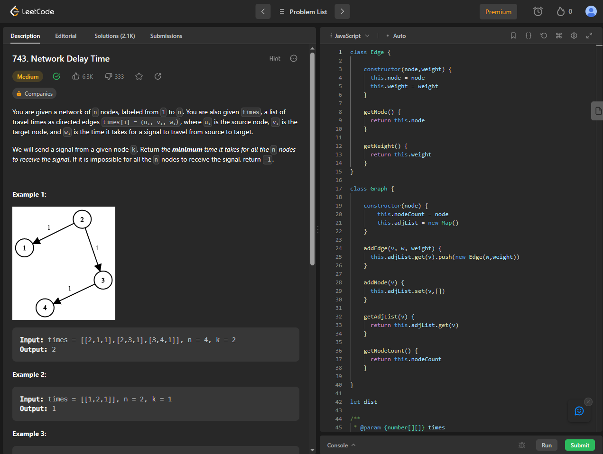
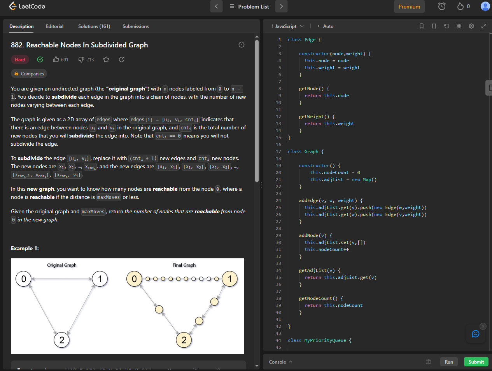
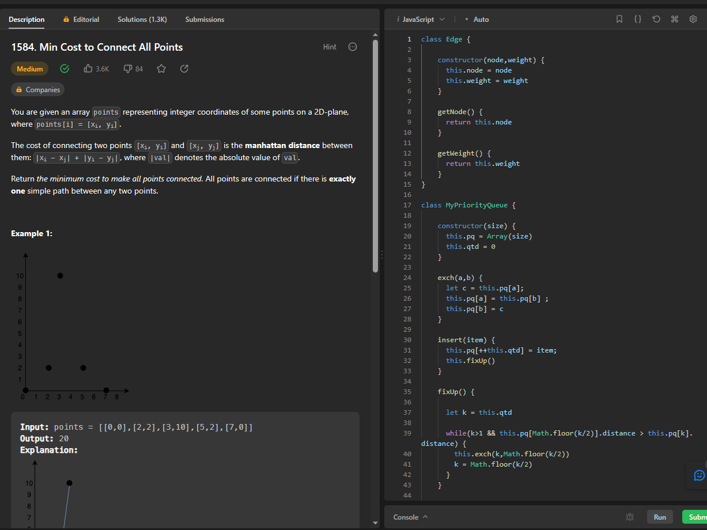

# Exercicios - LeetCode

**Número da Lista**: 2 
**Conteúdo da Disciplina**: Grafos 2 

## Alunos
|Matrícula | Aluno |
| -- | -- |
| 20/0028677 |  Vitor Manoel Aquino de Brito |

## Sobre 

Este repositório contém a resolução de 3 exercicios relacionados a Grafos, contemplando os algoritmos de Dijkstra (com array e fila de prioridade) e o algoritmo de Prim (com fila de prioridade). Os Exercicios realizados foram retirados do [LeetCode](https://leetcode.com/)

## [Link da Apresentação](https://youtu.be/8mLfLhq1yhE)

## Screenshots

## Exercicio 1 - Network Delay Time

Dificuldade: Médio  
Link: [Network Delay time](https://leetcode.com/problems/network-delay-time/)

## Exercicio 2 - Reachable Nodes in Subdivided Graph
Dificuldade: Difícil  
Link: [Reachable Nodes in Subdivided Graph](https://leetcode.com/problems/reachable-nodes-in-subdivided-graph/)

## Exercicio 3 - Min Cost to Connect All Points

Dificuldade: Médio  
Link: [Min Cost to Connect All Points](https://leetcode.com/problems/min-cost-to-connect-all-points/)

## Instalação 
**Linguagem**: javaScript 

Caso queira testar localmente é necessário ter o nodeJS instalado

## Uso 
Para verificar o funcionamento basta abrir o link do exercicio e copiar o código referente a questão, e logo após realizar o envio. Caso queira verificar localmente, é necessário adicionar a chamada da função principal com seus devidos paramêtros. para rodar basta utilizar o comando:

`node NomeDoArquivo.js`

